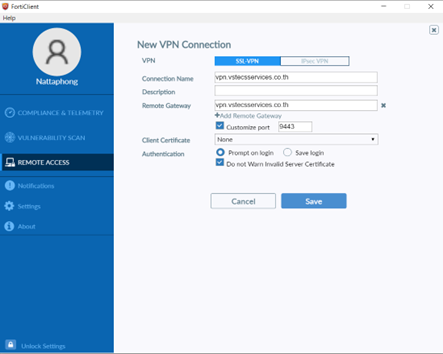
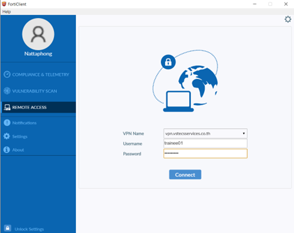

# Steps to create a new Virtual machine in vSphere Client

### To create a new virtual machine in vSphere Client, follow these steps:

#### 1. Open the [vcsa.yumtech.info](https://vcsa.yumtech.info). website and click on "Launch vSphere Client (HTML5)".

#### 2. Enter youremail@yumtech.info and password.

#### 3. Right-click on "Trainee" and select "New Virtual Machine".

#### 4. Click "Next".

#### 5. Enter a name for the virtual machine and click "Next" until you reach step 6.

#### 6. Select "Linux" and "CentOS 7" as shown in the image, then click "Next".

#### 7. Configure the virtual machine as shown in the image and click "Next".

#### 8. Click "Finish".

#### 9. Click on the name of the virtual machine. If it is not installed, click "Remote Console" and then click "Launch Remote Console".

