# Steps to create a new Virtual machine in vSphere Client

### To create a new virtual machine in vSphere Client, follow these steps:

#### 1. Open the [vcsa.yumtech.info](https://vcsa.yumtech.info). website and click on "Launch vSphere Client (HTML5)".

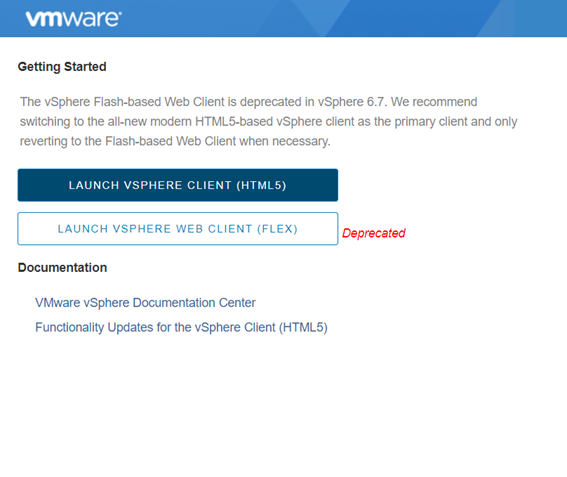

#### 2. Enter youremail@yumtech.info and password.

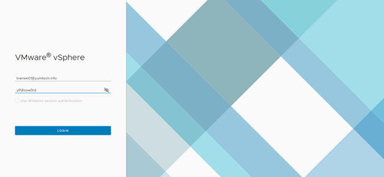

#### 3. Right-click on "Trainee" and select "New Virtual Machine".

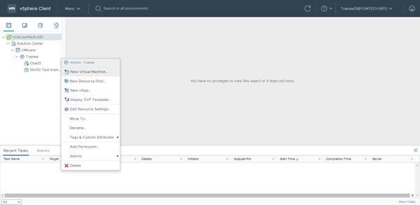

#### 4. Click "Next".

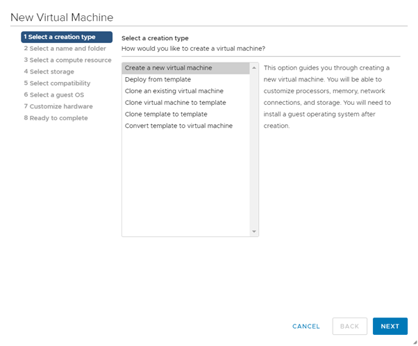

#### 5. Enter a name for the virtual machine and click "Next" until you reach step 6.

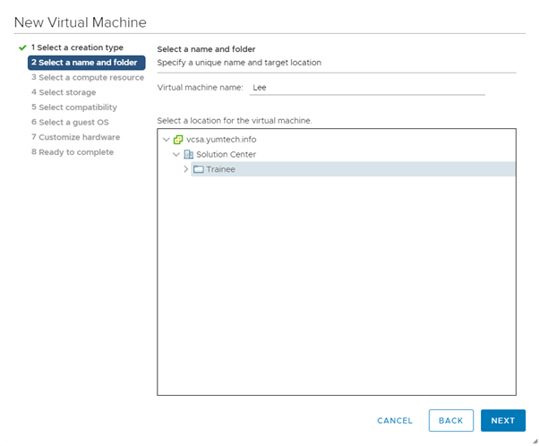

#### 6. Select "Linux" and "CentOS 7" as shown in the image, then click "Next".

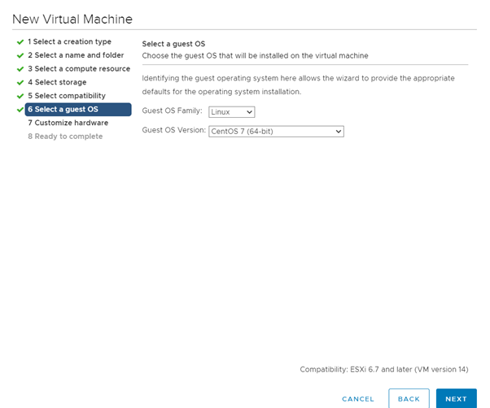

#### 7. Configure the virtual machine as shown in the image and click "Next".

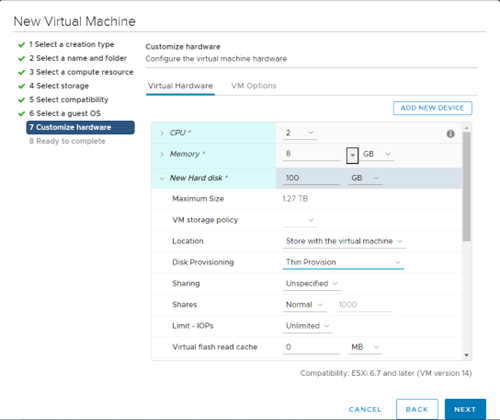

#### 8. Click "Finish".

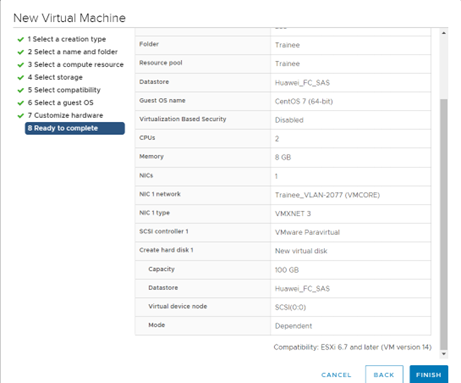

#### 9. Click on the name of the virtual machine. If it is not installed, click "Remote Console" and then click "Launch Remote Console".

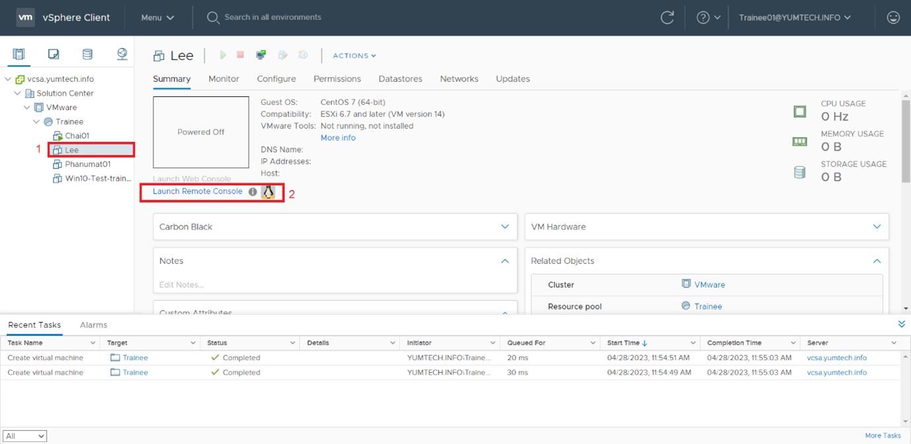

#### 10. Right-click on the virtual machine name and select "Edit settings".

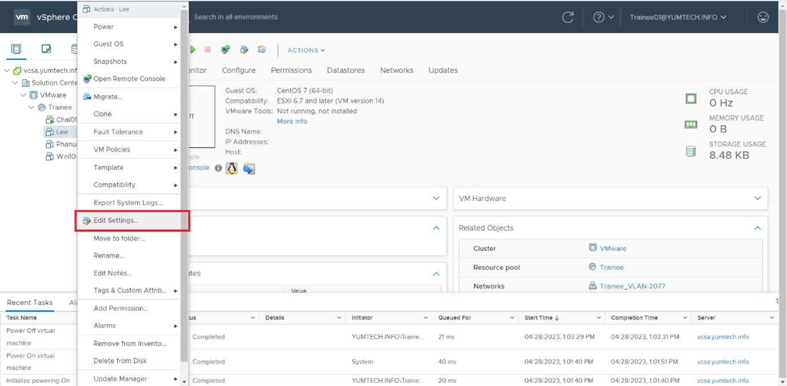

#### 11. Select the options as shown in the image.

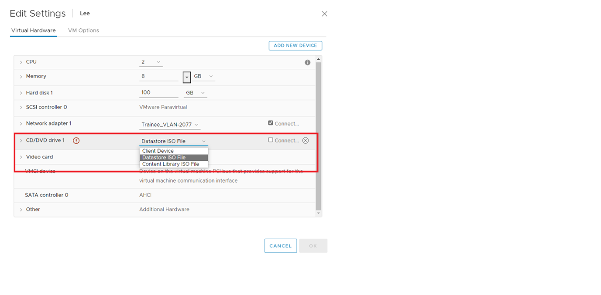

#### 12. Click "Select Folder" under the "CD/DVD Drive 1" section, then choose the ISO file as shown in the image.

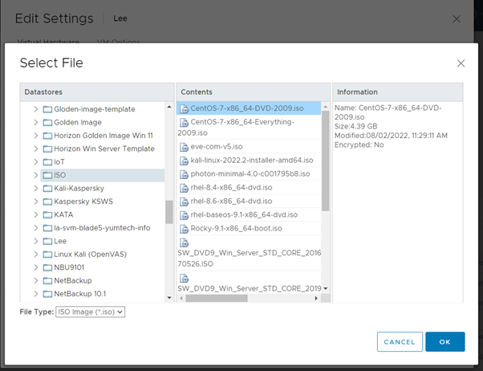

#### 13. Click "OK" and select the checkbox "Connect at power on", then click "OK".

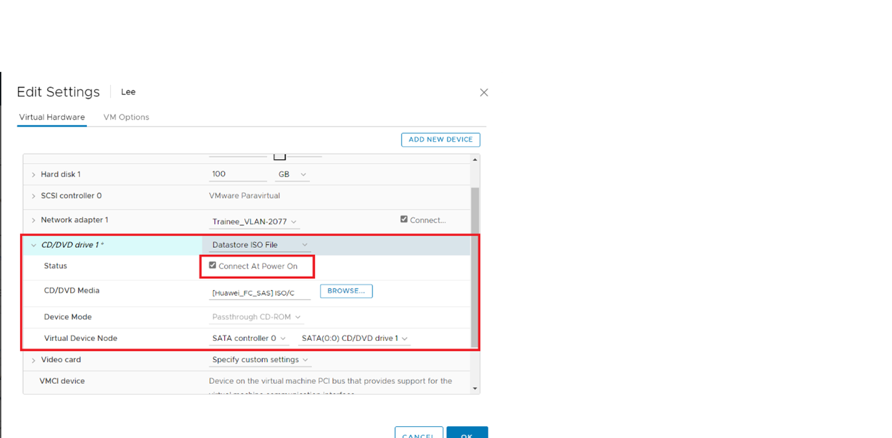

#### 14. Click "OK" and select the checkbox "Connect at power on", then click "OK".

#### 15. Click Launch Web console, the Console page will appear and wait until you get the image.

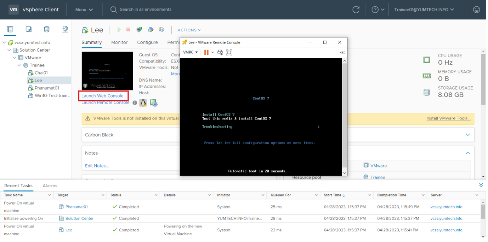

#### 16. Once you get this page, you can continue.

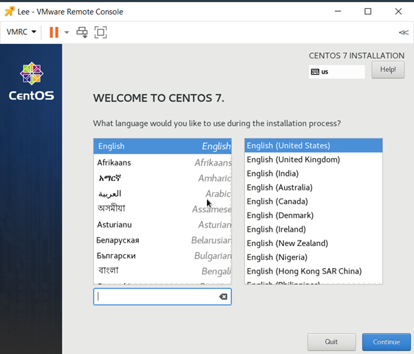

#### 17. Choose the appropriate installation option as shown in the image.

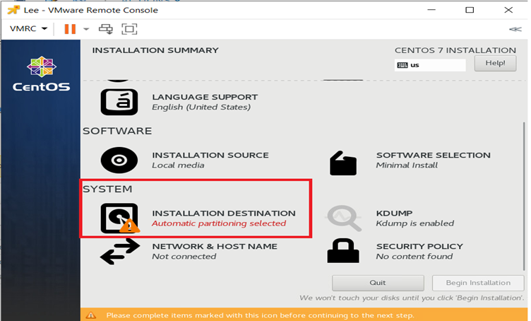

#### 18. Select the disk and click "Done".

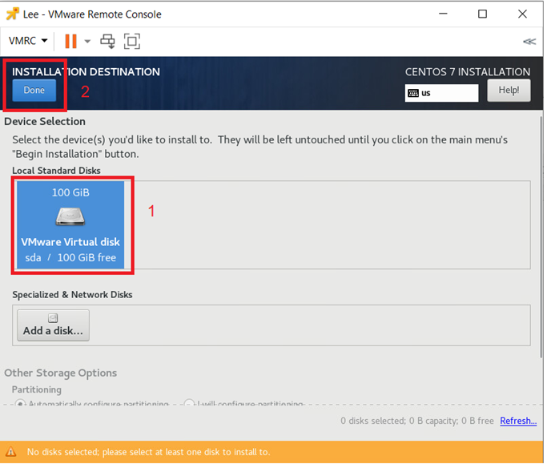

#### 18. Configure the network and hostname.

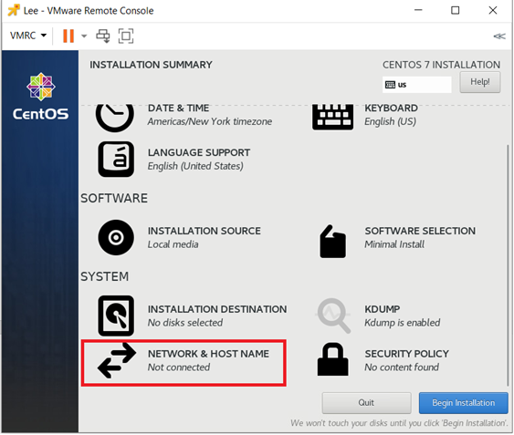

#### 19. Turn on the switch as shown in the image and click "Done".

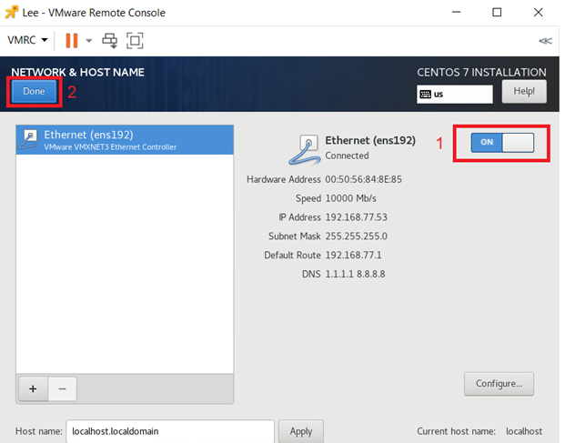

#### 20. Click "Install".

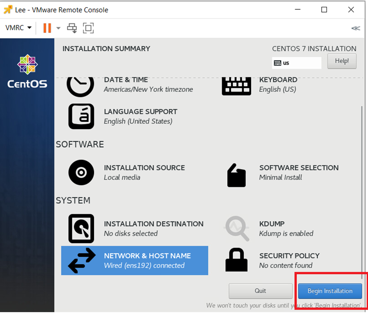

#### 21. Set the password and click "Done".

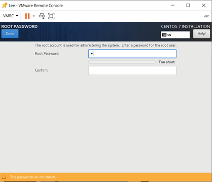

#### 22. Choose "User Creation" from the menu and enter the user information and select the "Make this user administrator" checkbox, then click "Done".

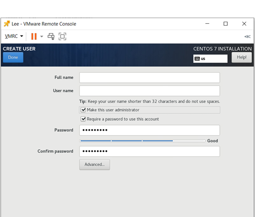

#### 23. Wait for the installation to complete, then click "Reboot".

#### 24. Enter your username and password when prompted to complete the setup.

#### 25. Congratulations, you have successfully created a new virtual machine in vSphere Client!

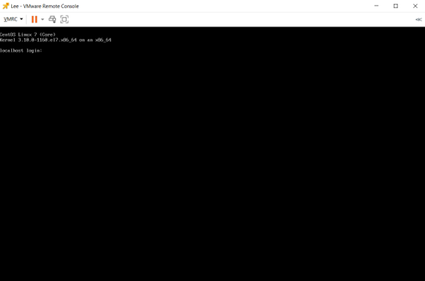
